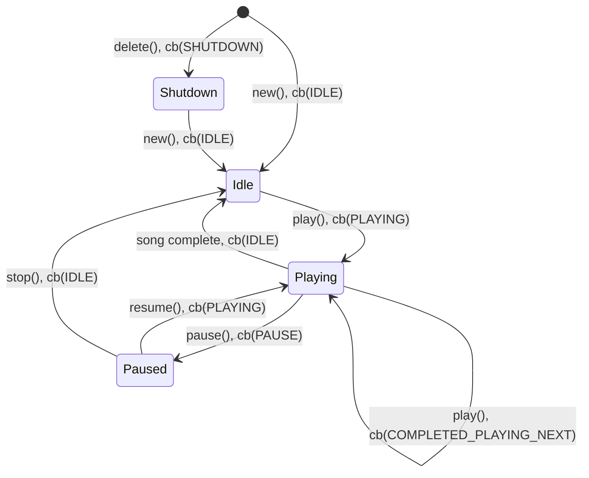

# Audio player component for esp32


[](https://github.com/chmorgan/esp-audio-player/actions/workflows/cppcheck.yml)

## Capabilities

* MP3 decoding (via libhelix-mp3)
* Wav/wave file decoding
* Audio mixing (multiple concurrent streams)
* HTTP/HTTPS audio streaming (with buffering)
* Abstract stream I/O interface (file, memory, HTTP, etc.)

## Who is this for?

Decode only audio playback on esp32 series of chips, where the features and footprint of esp-adf are not 
necessary.

## What about esp-adf?

This component is not intended to compete with esp-adf, a much more fully developed
audio framework.

It does however have a number of advantages at the moment including:

* Fully open source (esp-adf has a number of binary modules at the moment)
* Minimal size (it's less capable, but also simpler, than esp-adf)

## Getting started

### Examples

* [esp-box mp3_demo](https://github.com/espressif/esp-box/tree/master/examples/mp3_demo) uses esp-audio-player.
* The [test example](https://github.com/chmorgan/esp-audio-player/tree/main/test) is a simpler example than mp3_demo that also uses the esp-box hardware.

### How to use this?
[esp-audio-player is a component](https://components.espressif.com/components/chmorgan/esp-audio-player) on the [Espressif component registry](https://components.espressif.com).

In your project run:
```
idf.py add-dependency chmorgan/esp-audio-player
```

to add the component dependency to the project's manifest file.


## Dependencies

For MP3 support you'll need the [esp-libhelix-mp3](https://github.com/chmorgan/esp-libhelix-mp3) component.

## Static analysis

Install `cppcheck`, then run the full analysis from the repository root:

```sh
./scripts/run-cppcheck.sh
```

To check selected files or directories only, pass them as arguments:

```sh
./scripts/run-cppcheck.sh audio_mp3.cpp
```

## Tests

Unity tests are implemented in the [test/](../test) folder.

The host codec tests parse and decode a generated WAV stream and the bundled MP3
sample without ESP hardware. On Linux or macOS with CMake, Git, and a C/C++
compiler installed, run:

```sh
./scripts/run-host-codec-tests.sh
```

The script downloads the pinned `libhelix-mp3` revision, builds the production
stream and codec sources, and runs the tests with CTest.


## Audio Mixer

The Audio Mixer allows for concurrent playback of multiple audio streams. It supports two types of streams:

* **Decoder Streams**: For playing MP3 or WAV files. Each stream runs its own decoding task.
* **Raw PCM Streams**: For writing raw PCM data directly to the mixer.

### Basic Mixer Usage

1. Initialize the mixer with output format and I2S write functions.
2. Create one or more streams using `audio_stream_new()`.
3. Start playback on the streams.

```c
audio_mixer_config_t mixer_cfg = {
    .write_fn = bsp_i2s_write,
    .clk_set_fn = bsp_i2s_reconfig_clk,
    .i2s_format = {
        .sample_rate = 44100,
        .bits_per_sample = 16,
        .channels = 2
    },
    // ...
};
audio_mixer_init(&mixer_cfg);

audio_stream_config_t stream_cfg = DEFAULT_AUDIO_STREAM_CONFIG("bgm");
audio_stream_handle_t bgm_stream = audio_stream_new(&stream_cfg);

FILE *f = fopen("/sdcard/music.mp3", "rb");
audio_stream_play(bgm_stream, f);
```

## HTTP Streaming

Play audio directly from HTTP/HTTPS URLs with built-in buffering and auto-reconnection support.

### Enabling HTTP Streaming

In `idf.py menuconfig`:
```
Audio playback → Enable HTTP streaming support
```

### Basic HTTP Streaming Usage

```c
#include "audio_stream.h"
#include "audio_http_stream.h"
#include "audio_stream_io.h"

// Initialize mixer first (see above)

// Create a stream
audio_stream_config_t stream_cfg = DEFAULT_AUDIO_STREAM_CONFIG("radio");
audio_stream_handle_t stream = audio_stream_new(&stream_cfg);

// Open HTTP stream
audio_http_stream_config_t http_cfg = DEFAULT_AUDIO_HTTP_STREAM_CONFIG(
    "http://example.com/audio.mp3"
);
audio_http_stream_handle_t http_stream = audio_http_stream_open(&http_cfg);

// Get the stream I/O interface and play
audio_stream_io_handle_t io;
audio_http_stream_get_io(http_stream, &io);
audio_stream_play_io(stream, io);

// When done, remember to close the HTTP stream
// audio_http_stream_close(http_stream);
```

### Memory/Buffer Playback

Play audio from a memory buffer using the abstract stream I/O interface:

```c
const uint8_t *mp3_data = ...; // your MP3 data in memory
size_t mp3_size = ...;          // size of the MP3 data

audio_stream_io_handle_t io = audio_stream_io_from_memory(mp3_data, mp3_size, true);
audio_stream_play_io(stream, io);
```

### HTTP Stream Configuration

```c
audio_http_stream_config_t http_cfg = {
    .url = "http://example.com/audio.mp3",
    .buffer_size = 64 * 1024,        // 64KB buffer
    .low_watermark = 16 * 1024,       // Pause playback when < 16KB buffered
    .high_watermark = 48 * 1024,      // Resume playback when > 48KB buffered
    .reconnect_timeout_ms = 5000,      // Try to reconnect after 5 seconds
    .read_timeout_ms = 10000,          // Read timeout 10 seconds
    .enable_auto_reconnect = true      // Auto-reconnect on disconnect
};
```

### HTTP Stream Events

Register event callbacks to monitor connection status:

```c
static void http_event_handler(audio_http_stream_event_t event, void *user_ctx) {
    switch (event) {
        case AUDIO_HTTP_STREAM_EVENT_CONNECTED:
            ESP_LOGI(TAG, "Connected to server");
            break;
        case AUDIO_HTTP_STREAM_EVENT_BUFFERING:
            ESP_LOGI(TAG, "Buffering...");
            break;
        case AUDIO_HTTP_STREAM_EVENT_BUFFER_READY:
            ESP_LOGI(TAG, "Buffer ready, starting playback");
            break;
        case AUDIO_HTTP_STREAM_EVENT_ERROR:
            ESP_LOGE(TAG, "Stream error");
            break;
        default:
            break;
    }
}

audio_http_stream_register_cb(http_stream, http_event_handler, NULL);
```

## States



Note: Diagram shortens callbacks from AUDIO_PLAYER_EVENT_xxx to xxx, and functions from audio_player_xxx() to xxx(), for clarity.


## Release process - Pushing component to the IDF Component Registry

The github workflow, .github/workflows/esp_upload_component.yml, pushes data to the espressif
[IDF component registry](https://components.espressif.com).

To push a new version:

* Apply a git tag via 'git tag vA.B.C'
* Push tags via 'git push --tags'

The github workflow *should* run and automatically push to the IDF component registry.
